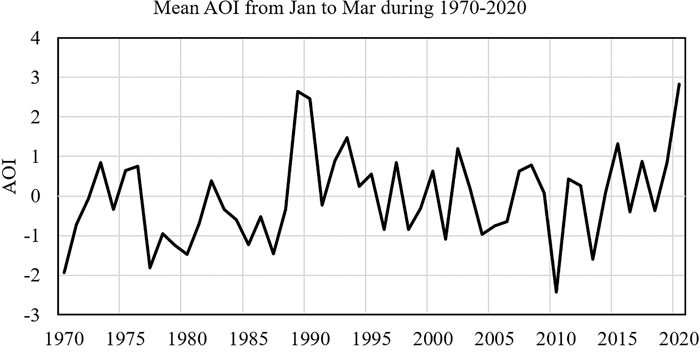
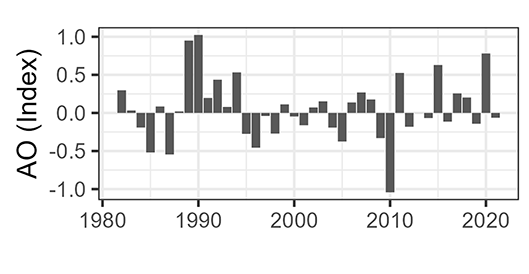

```{r setup, include=FALSE}
knitr::opts_chunk$set(echo = TRUE)
library('kableExtra')
library('grid')
library('plotly')

options(scipen = 999)
options(warn=-1)

source(paste0(here::here(), "/analysis/0_env_data.R"))

```


This short document provides details on the work carried out to assess environmental effects on reproductive parameters of harp seals in the Northwest Atlantic.     
This document is intended for internal use of the Fisheries and Oceans Canada team.       
Project led by Garry Stenson and Shelley Lang. 

Code and environemntal data to reproduce the analyses summarized in this document can be found in [**this repository**](https://github.com/adbpatagonia/PG_ReproductivePaper).     
Seal and prey field data will not be made available in the repository


# Questions                


# Data      

## Biological data        

### Population size        

Garry (or Shelley) to provide

### Female reproductive data            

Shelley to provide     


### Age data       

Shelley to provide   

### Morphometric data       

Shelley to provide   

          

## Prey field      

Garry requested capelin data from Aaron.            
Garry to contact MKA to request *Boreogadus*, shrimp, and sandlance indices from the fall survey         

## Environmental Indices         

### Newfoundland and Labrador Climate Index            

Downloaded    

 @Cyr2020: https://doi.org/10.20383/101.0301                 
 
 
```{r nlciplot, echo = FALSE}
p.nlci
``` 
 
### NAO            


Hurrell NAO Index  (DJFM)

https://climatedataguide.ucar.edu/sites/default/files/2023-07/nao_station_djfm.txt     

https://climatedataguide.ucar.edu/climate-data/hurrell-north-atlantic-oscillation-nao-index-station-based


```{r naoplot, echo = FALSE}
p.nao
```


### Atlantic Multidecadal Oscillation         

For the capelin paper (@Buren_etal_2014) we used the 121-month smoothed estimates      

The AMO was based on the Kaplan SST, but the dataset is not being updated anymore.  
https://psl.noaa.gov/data/timeseries/AMO/   

Therefore, I downloaded a few different options: 

1. Kaplan, unsmoothed: data/environment/AMO/amon.us.data.txt    
https://psl.noaa.gov/data/correlation/amon.us.data    https://psl.noaa.gov/data/correlation/amon.us.long.data    
Data up to 2022          

2. Kaplan, smoothed: data/environment/AMO/amon.sm.data      
https://psl.noaa.gov/data/correlation/amon.sm.data     https://psl.noaa.gov/data/correlation/amon.sm.long.data
Data up to Jan 2018       

3. NOAA/NCEI has a time-series of the AMO based on the NOAA ERSSTV5: data/environment/AMO/ersst.v5.amo.dat.txt    
https://www1.ncdc.noaa.gov/pub/data/cmb/ersst/v5/index/ersst.v5.amo.dat   
Data up to July 2024     


#### Kaplan dataset     

Last smoothed estimate is from January 2018      

<ins>Method:</ins>                 

  * Use the Kaplan SST dataset     
  * Compute the area weighted average over the N Atlantic, basically 0 to 70N.  
  * Detrend that time series        
  * Smooth it with a 121 month smoother.          
  
```{r amokaplan, echo = FALSE}
p.amo.kaplan
``` 


#### NOAA/NCEI dataset     

Last smoothed estimate is from July 2019       

I applied the same smoother as applied to the Kaplan dataset.     

It looks like these data have not been detrended. AMO code is provided in the PSL website, (code provided by NCAR: National Center for Atmospheric Research) [**here**](https://www.ncl.ucar.edu/Applications/Scripts/index_amo_1.ncl). 


```{r amonoaa, echo = FALSE}
p.amo.noaa
``` 

#### Conclusion        

The two datasets look similar, but the NOAA/NCEI has not been detrended.   
NCAR provides AMO code. I am not sure what language this is, but I am sure that if we needed to use this dataset we could figure it out.        
Note the very similar length  of the datasets:    

  * Kaplan: up to January 2018     
  * NOAA/NCEI: up to July 2019      
  
Note that these data are still at a monthly scale. We still need to define how we will translate it to an annual value.         
Thoughts on how to proceed?

### Arctic Oscillation      

Downloaded

https://www.cpc.ncep.noaa.gov/products/precip/CWlink/daily_ao_index/monthly.ao.index.b50.current.ascii

https://www.cpc.ncep.noaa.gov/products/precip/CWlink/daily_ao_index/ao.shtml                   


Data is at a monthly scale. We need to smooth it. How should we do it? I can think of at least two options:           

  *  use a running average, as for AMO             
  *  use seasonal mean, as for NAO. See @Zhang_etal_2021          
  
I am not sure how to approach this. I couldn't find any details in @Mullowney_etal_2023  on how they approached it. Maybe Shelley can check in with Darrell or Fred?       
```{r aoplot, echo = FALSE}
p.ao
```

#### Smoothed                

Last smoothed estimate is from August 2019       

I applied the same smoother as applied to the AMO Kaplan dataset, not detrended. 

```{r aosmplot, echo = FALSE}
p.ao.sm
```

#### Seasonal        

This reproduces  @Zhang_etal_2021, *i.e.* mean AO from January to March

```{r aoseasonalplot, echo = FALSE}
p.ao.seasonal
```

This is the plot presented by @Zhang_etal_2021      


This plot presents it in a similar fashion as @Mullowney_etal_2023. It is quite close, but not identical   

```{r aoseasonalbarplot, echo = FALSE}
p.ao.seasonal.bars
```

This is the plot presented by @Mullowney_etal_2023      


#### Conclusion        

I can perfectly reproduce @Zhang_etal_2021.     
I can almost reproduce @Mullowney_etal_2023.   
The smoothed estimate does not look like what is presented in @Mullowney_etal_2023.     

I think the important question here is: what is the expected effect of AO on the environment?   
Can Shelley approach Fred?   

### Ice Area Cover                

Downloaded from Canadian Ice Service    

https://iceweb1.cis.ec.gc.ca/IceGraph/page1.xhtml?lang=en        

In @Stenson_etal_2016: *As a proxy for habitat change, we used the annual percentage midwinter ice area cover (week of 29 January). The percentage of ice cover was defined as the proportion of the regional East Coast (area: 1 975 854 km<sup>2</sup>) that was covered by first-year ice (≥30 cm thickness)*  


```{r iceplot, echo = FALSE}
p.ice
```

### Correlations among environmental variables     

I have not included AMO here as it is still expressed at a monthly scale   

All variables are correlated to a higher or lesser degree, except Ice Area Cover and AOI (mean of JFM AO)
    
```{r envcorrsplot, echo = FALSE}
p.env.corrs
```


# Methods                      
# Results               

# References            
