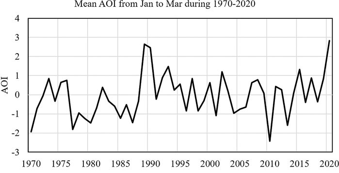
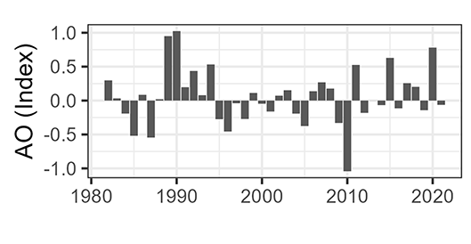

```{r setup, include=FALSE}
knitr::opts_chunk$set(echo = TRUE)
library('kableExtra')
library('grid')
library('plotly')

options(scipen = 999)
options(warn=-1)

source(paste0(here::here(), "/analysis/0_env_data.R"))
source(paste0(here::here(), "/analysis/0_seal_data.R"))
source(paste0(here::here(), "/analysis/0_prey_data.R"))

```


This short document provides details on the work carried out to assess environmental effects on reproductive parameters of harp seals in the Northwest Atlantic.     
This document is intended for internal use of the Fisheries and Oceans Canada team.       
Project led by Garry Stenson and Shelley Lang. 

Code and environemntal data to reproduce the analyses summarized in this document can be found in [**this repository**](https://github.com/adbpatagonia/PG_ReproductivePaper).     
Seal and prey field data will not be made available in the repository


# Questions                


# Data      

## Biological data        

### Population size        

Shelley provided population numbers (Jan 10, 2025) - courtesy of Joanie

```{r sealpop, echo = FALSE}
p.seal.pop
``` 
 

### Morphometric data       

Here is the *female* LW relationship. 
$W = aL^b$

I am considering only beater and older here (based on pelage type). Also excluded foetus, stillborn & starvling    

```{r LW, echo = FALSE, fig.height= 8 , fig.width=8}
ggplotly(p.lw)
``` 

### Relative condition    

Using the LW relationship, I calculated the relative condition of seal $\textit{i}$ as $K_{r_i} = \frac{Weight_i}{\widehat{Weight_i}}$


#### All maturity stages     

Several things here:   


   * Immature: high variability, centered around 1    
   * NA: high variability, similar to immature - it would be nice to resolve these NAs if at all possible
   * Mature, pregnant: consistently high condition    
   * Mature, lactating: good K   
   * Mature, not pregnant, parous: similar to immature    
   * Mature, recently given birth outside of norma period: mean above 1 - should the category "Harp; early pupper unk" be merged with this?   
   * Mature, pregnant (delay period): low   
   * There are clear year effects (e.g. 2004 vs early 80's)
   
```{r generalK, echo = FALSE,  fig.height= 8 , fig.width=8}
ggplotly(
  plotdat[!idsex %in% id_outs] %>%
    mutate(krel = krel(length, weight)) %>%
    left_join(morphagerepro[,.(idsex = ID.Sex, Female.Maturity, Month )]) %>%
    ggplot(.,aes(x = (cohortyear),
                 y = krel,
                 fill = Female.Maturity)) +
    geom_hline(yintercept = 1) +
    geom_quasirandom(
      # side = 1,
      alpha = .8, pch = 16,
      # corral = "gutter",
      # method = "compactswarm",
      cex = 1,
      # corral.width = 0.4,
      # stat = density,
      aes(color = factor(cohortyear), label = idsex)) +
    labs(x = "Cohort year", y = "Relative condition") +

    facet_wrap(.~Female.Maturity) +
    scale_x_continuous(breaks = seq(1978, 2022, 2), limits = c(1978, 2022)) +
    theme(legend.position = "none",
          axis.text.x = element_text(angle = 45),
          panel.grid.minor = element_blank()) +
    geom_smooth()
)
```


#### Mature females       


Here we can see the seasonal effects, particularly for i) Post lactation, ii) Delay period, iii) parous

```{r matureK, echo = FALSE, fig.height= 8 , fig.width=8}
ggplotly(
  plotdat[!idsex %in% id_outs] %>%
    mutate(krel = krel(length, weight)) %>%
    filter(codefemmat %in%  c(2:5, 8,7)) %>%
    left_join(morphagerepro[,.(idsex = ID.Sex,  Month )]) %>%
    transform(femmat = factor(femmat,
                              levels = c(
                                'Mature; pregnant (implanted embryo)',
                                'Mature; lactating',
                                'Mature; post lactation/prior to ovulation',
                                'Mature; recently given birth outside of normal period',
                                'Mature; pregnant (delay period)',
                                'Mature; not-pregnant, parous'
                              ))) %>%
    ggplot(.,aes(x = (cohortyear),
                 y = krel,
                 fill = femmat )) +
    # geom_half_violin(side = "l", alpha = 0.6, trim = FALSE, fill = 'gray60') +
    # geom_half_point(alpha = 0.3) +
    # geom_beeswarm(
    #   # side = 1,
    #   alpha = .8, pch = 16,
    #   corral = "gutter",
    #   method = "compactswarm",
    #   cex = 1,
    #   corral.width = 0.4,
    #   # stat = density,
    #   aes(color = factor(cohortyear))) +
  geom_hline(yintercept = 1) +
    geom_quasirandom(
      # side = 1,
      alpha = .8, pch = 16,
      # corral = "gutter",
      # method = "compactswarm",
      cex = 1,
      # corral.width = 0.4,
      # stat = density,
      aes(color = factor(cohortyear), label = idsex)) +
    labs(x = "Cohort year", y = "Relative condition") +
    facet_grid(femmat ~Month) +
    scale_x_continuous(breaks = seq(1978, 2022, 2), limits = c(1978, 2022)) +
    theme(legend.position = "none",
          axis.text.x = element_text(angle = 45),
          panel.grid.minor = element_blank())# +
  # geom_smooth()
)

```          

## Prey field      

GBS received data from MKA on 2025-06-25           


We will use the prey field available to seals in the fall (Fall RV)     

Notes from MKA:    

  * The Fall RV series is restricted to the Campelen series because it is more reliable for small pelagics and the only one with shrimp data   
  * The Non-pandalus Shrimp corresponds to all "shrimp-like" spp recorded in the survey under the 8020 code. This code also includes Pandalus spp, so the numbers provided here are basically "all 8020 minus Pandalus spp"     
  * All the Fall RV data have been converted to "modified Campelen" (the new boats) using the available conversion factors. This was possible because there are conversion factors for these groups for Fall 2J3KL.    

 
```{r fallprey, echo = FALSE}
p.prey.fall
p.prey.fall.log
``` 
 
 
MKA also sent 3L spring acoustic survey   

Notes from MKA:    

  * The 3L Capelin acoustic series is the one provided to me by the Pelagics Section (Aaron Adamack, Ron Lewis) for the 2025 Capelin assessment. The figures in red are the assigned or linearly interpolated ones that I use for running the capcod model.   
  
Note from ADB:   

  * I filtered out all interpolated and assigned biomass values    
  
```{r springcapelin, echo = FALSE}
p.prey.spring
p.prey.spring.log
``` 

## Environmental Indices         

### Newfoundland and Labrador Climate Index            

Downloaded    

 @Cyr2020: https://doi.org/10.20383/101.0301                 
 
 
```{r nlciplot, echo = FALSE}
p.nlci
``` 
 
### NAO            


Hurrell NAO Index  (DJFM)

https://climatedataguide.ucar.edu/sites/default/files/2023-07/nao_station_djfm.txt     

https://climatedataguide.ucar.edu/climate-data/hurrell-north-atlantic-oscillation-nao-index-station-based


```{r naoplot, echo = FALSE}
p.nao
```


### Atlantic Multidecadal Oscillation         

For the capelin paper (@Buren_etal_2014) we used the 121-month smoothed estimates      

The AMO was based on the Kaplan SST, but the dataset is not being updated anymore.  
https://psl.noaa.gov/data/timeseries/AMO/   

Therefore, I downloaded a few different options: 

1. Kaplan, unsmoothed: data/environment/AMO/amon.us.data.txt    
https://psl.noaa.gov/data/correlation/amon.us.data    https://psl.noaa.gov/data/correlation/amon.us.long.data    
Data up to 2022          

2. Kaplan, smoothed: data/environment/AMO/amon.sm.data      
https://psl.noaa.gov/data/correlation/amon.sm.data     https://psl.noaa.gov/data/correlation/amon.sm.long.data
Data up to Jan 2018       

3. NOAA/NCEI has a time-series of the AMO based on the NOAA ERSSTV5: data/environment/AMO/ersst.v5.amo.dat.txt    
https://www1.ncdc.noaa.gov/pub/data/cmb/ersst/v5/index/ersst.v5.amo.dat   
Data up to July 2024     


#### Kaplan dataset     

Last smoothed estimate is from January 2018      

<ins>Method:</ins>                 

  * Use the Kaplan SST dataset     
  * Compute the area weighted average over the N Atlantic, basically 0 to 70N.  
  * Detrend that time series        
  * Smooth it with a 121 month smoother.          
  
```{r amokaplan, echo = FALSE}
p.amo.kaplan
``` 


#### NOAA/NCEI dataset     

Last smoothed estimate is from July 2019       

I applied the same smoother as applied to the Kaplan dataset.     

It looks like these data have not been detrended. AMO code is provided in the PSL website, (code provided by NCAR: National Center for Atmospheric Research) [**here**](https://www.ncl.ucar.edu/Applications/Scripts/index_amo_1.ncl). 


```{r amonoaa, echo = FALSE}
p.amo.noaa
``` 

#### Conclusion        

The two datasets look similar, but the NOAA/NCEI has not been detrended.   
NCAR provides AMO code. I am not sure what language this is, but I am sure that if we needed to use this dataset we could figure it out.        
Note the very similar length  of the datasets:    

  * Kaplan: up to January 2018     
  * NOAA/NCEI: up to July 2019      
  
Note that these data are still at a monthly scale. We still need to define how we will translate it to an annual value.         
Thoughts on how to proceed?

#### Annualize AMO        

follow the same strategy as for NAO and AO, *i.e.* get the JFM mean    

In this plot,   

  * thin line: extracted and averaged the JFM values of the unsmoothed Kaplan dataset       
  * thick black line: extracted and averaged the JFM values of the smoothed Kaplan dataset    
  * thick red line: extracted and averaged the JFM values of the unsmoothed Kaplan dataset, and obtained the 10-year (equivalent to 121-month) rolling average       
    
```{r annualamonoaa, echo = FALSE}
p.amo.kaplan.annual
```   
    

### Arctic Oscillation      

Downloaded

https://www.cpc.ncep.noaa.gov/products/precip/CWlink/daily_ao_index/monthly.ao.index.b50.current.ascii

https://www.cpc.ncep.noaa.gov/products/precip/CWlink/daily_ao_index/ao.shtml                   


Data is at a monthly scale. We need to smooth it. How should we do it? I can think of at least two options:           

  *  use a running average, as for AMO             
  *  use seasonal mean, as for NAO. See @Zhang_etal_2021          
  
I am not sure how to approach this. I couldn't find any details in @Mullowney_etal_2023  on how they approached it. Maybe Shelley can check in with Darrell or Fred?       
```{r aoplot, echo = FALSE}
p.ao
```

#### Smoothed                

Last smoothed estimate is from August 2019       

I applied the same smoother as applied to the AMO Kaplan dataset, not detrended. 

```{r aosmplot, echo = FALSE}
p.ao.sm
```

#### Seasonal        

This reproduces  @Zhang_etal_2021, *i.e.* mean AO from January to March

```{r aoseasonalplot, echo = FALSE}
p.ao.seasonal
```

This is the plot presented by @Zhang_etal_2021      

#### Annual        

This plot presents it in a similar fashion as @Mullowney_etal_2023, annual means

```{r aoseasonalbarplot, echo = FALSE}
p.ao.seasonal.bars
```

This is the plot presented by @Mullowney_etal_2023      


#### Comparison annual - seasonal              

I calculated both, and standardized (mean = 0, sd = 1) to visualize trends, without worrying about magnitudes - this is how we will most likely use all indices in the modelling exercises   

```{r aoboth, echo = FALSE, fig.width=13,fig.height=8}
p.ao.compare
```


#### Conclusion        

We can dismiss the smoothed index.   
I can perfectly reproduce @Zhang_etal_2021.     
I can perfectly reproduce @Mullowney_etal_2023.   

When we plot both together, they are very similar. There are some small differences - do these matter?        
I think the important question here is: what is the expected effect of AO on the environment?   
Can Shelley approach Fred?   

### Ice Area Cover                

Downloaded from Canadian Ice Service    

https://iceweb1.cis.ec.gc.ca/IceGraph/page1.xhtml?lang=en        

In @Stenson_etal_2016: *As a proxy for habitat change, we used the annual percentage midwinter ice area cover (week of 29 January). The percentage of ice cover was defined as the proportion of the regional East Coast (area: 1 975 854 km<sup>2</sup>) that was covered by first-year ice (≥30 cm thickness)*  


```{r iceplot, echo = FALSE}
p.ice
```

### Correlations among environmental variables     

In this plot, the AMO is the annualized taking the JFM mean of the smoothed values, *i.e.* the black thick line in [Annualize AMO](#annualize-amo)   


<ins>High correlation (> 0.5):</ins>    

  * winter NAO and AO (0.78)   
  * NLCI and Ice Area (-0.76)   

<ins>Moderate correlation (between 0.3 and 0.5):</ins>    

  * winter NAO and NLCI (-0.49)   
  * winter AMO and NLCI (0.41)   
  * winter AMO and Ice Area (-0.4)  
  * winter NAO and Ice Area (0.37)    
  * NLCI and AO (-0.34)     
  
<ins>Low correlation (< 0.3):</ins>         

  * Ice Area and AO (0.123)      
  * winter AMO and AO (0.1)       
  * winter AMO and winter NAO (-0.01)

<!-- All variables are correlated to a higher or lesser degree, except Ice Area Cover and AOI (mean of JFM AO) -->
    
```{r envcorrsplot, echo = FALSE}
p.env.corrs
```

Maybe we are OK like this? *i.e.* dropping NLCI and NAO   
I would really like to understand the hypothesized effect of each index on the environment to make this decision, but maybe I am asking too much?                

```{r envcorrsplotreduced, echo = FALSE}
 ggpairs(env.dat %>% select(-year, -NLCI, -winterNAO))
```

This would also be in line with how one would approach this by looking at multicollinearity through variance inflation factors (@Zuur_etal_2010). Drop the variable with the highest VIF until all variables have VIFs < 3.  
  
<br />               

All variables    

```{r VIFS,  echo=FALSE, message=FALSE, warning=FALSE}

kable(vifs, digits = 2) %>% 
  kable_styling(bootstrap_options = c("striped", "hover"),
                full_width = FALSE) 
``` 

Dropping NLCI 

```{r VIFS_no_NLCI,  echo=FALSE, message=FALSE, warning=FALSE}

kable(vifs_nonlci, digits = 2) %>% 
  kable_styling(bootstrap_options = c("striped", "hover"),
                full_width = FALSE) 
``` 

Dropping winter NAO - all VIFs < 3

```{r VIFS_reduced,  echo=FALSE, message=FALSE, warning=FALSE}

kable(vifs.reduced, digits = 2) %>% 
  kable_styling(bootstrap_options = c("striped", "hover"),
                full_width = FALSE) 
``` 

Note: we agreed this is a purely statistical approach to variable selection. However, we will consider NLCI in our runs - it includes seeral of the variables (thus the correlations), and ecological hypotheses have been formulated using this index (fred Cyr et al.'s work). We will go through a different variable selection process for that set: 1. exclude datasets included in the NLCI, 2. follow the VIF approach for the remaining (if any) variables.

# Methods                      
# Results               

# References            
